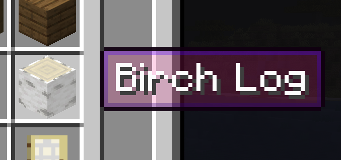
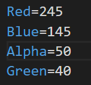

# More Translucent Tooltips

Allows for more translucent tooltips in the game.

# Use
- Drop the mod in the mods folder of your game instance.
- Run the game - it will create a config file for the mod after running.
- Find the config file for the mod which is in the instance config files (`config/MoreTranslucentTooltipsConfig.properties`)
- Close the game
- Edit the `Alpha`, `Red`, `Green`, `Blue` values in the config file to contain the color you want the tooltip to be.

- Run the game again and the selected color should be visible in the tooltips
## License

[The Unlicense](http://unlicense.org/)
